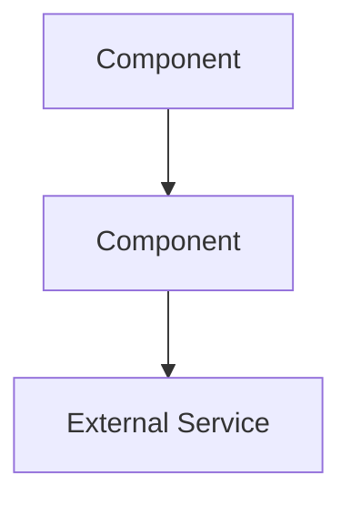

# Global Development Standards

Standards for ALL projects unless overridden by project-specific `.claude/CLAUDE.md`.

---

## ⚠️ MANDATORY - READ FIRST

### Workflow After Code Changes

For changes **>20 lines or touching security/validation**:
1. Run `code-reviewer` agent → BEFORE commit
2. Run `docs-updater` agent → For user-facing changes
3. Verify 80%+ test coverage, linter passes, all tests pass
4. 🆕 **Verify Definition of Done** (see section below)

For **small changes (<20 lines, non-security)**: Run tests and linter only.

### New Project Setup

If project lacks `.claude/CLAUDE.md`: **ASK** user to create one before coding.

🆕 **Before implementing any feature**, confirm:
- User story exists: "As a [user type], I can [action] so that [outcome]"
- Acceptance criteria are defined (how to manually verify it works)
- For projects with >2 components: architecture diagram exists or will be created

### Token Optimization

- **Use `model: "haiku"`** for simple agent tasks (searches, formatting, straightforward generation)
- **Prefer Glob/Grep** over Explore agent for simple file/code searches
- **Use `/clear`** between unrelated tasks
- **Use `/compact`** when context grows large but continuity needed
- Suggest these commands proactively when appropriate

---

🆕 ## Definition of Done

**Nothing is "done" until these are verified.** Check applicable items before marking complete.

### All Projects
- [ ] README enables clone-to-running in <5 minutes (test mentally or actually)
- [ ] A new engineer unfamiliar with the project can understand what it does and how to use it
- [ ] All documented commands/steps actually work (no stale instructions)
- [ ] Error messages are actionable (user knows what went wrong and how to fix)

### Web Applications
- [ ] Core user flows work end-to-end (not just API endpoints)
- [ ] Basic UI states handled: loading, empty, error, success
- [ ] Can demonstrate the happy path manually in browser
- [ ] Forms have validation with user-visible feedback
- [ ] Navigation between features works

### CLI Tools / Libraries
- [ ] `--help` output is accurate and useful
- [ ] At least one realistic usage example in README
- [ ] Exit codes are meaningful (0 = success, non-zero = failure)
- [ ] Errors print to stderr, output to stdout

### Infrastructure / Automation
- [ ] Runbook or operational doc exists for non-obvious operations
- [ ] Failure modes documented (what breaks, how to recover)
- [ ] Dependencies and prerequisites explicitly listed

---

🆕 ## Architecture Documentation

**Required** for any project with >2 components, services, or external integrations.

### What to Document
Create `docs/architecture.md` (or section in README for simple projects) containing:


Must show:
- Component/service boundaries
- Data flow direction (arrows)
- External dependencies (APIs, databases, queues)
- Key interfaces between components

### When to Update
- Adding new component or service
- Changing integration patterns
- Adding external dependencies
- Modifying data flow

**Before implementing multi-component features**: Create/update diagram first, then code.

---

## Core Principles

1. **Security First** - Non-negotiable
2. **Test Everything** - 80% minimum coverage
3. **Document Changes** - Keep docs current
4. 🆕 **User-Verifiable** - If you can't demo it, it's not done
5. **Readable Code** - Self-documenting preferred
6. **Track with Git** - Atomic commits, clear messages

---

## Security Standards

### Mandatory Review Areas
Auth, validation, APIs, database queries, file operations, crypto, sessions, CORS

### Best Practices
- Never commit secrets (.env, API keys, credentials)
- Validate all inputs (user, API, files, env vars)
- Use secure defaults, least privilege, defense in depth
- Fail securely (no sensitive info in errors)

### Prevent OWASP Top 10
SQL injection, XSS, CSRF, insecure deserialization, XXE, SSRF, command injection, path traversal

---

## Testing Standards

- **80% minimum** coverage (100% for security/validation code)
- Unit tests: individual functions, mock dependencies, fast
- Integration tests: component interactions, API contracts
- Edge cases: null, empty, boundaries, errors, concurrency
- 🆕 **Smoke tests**: For web apps, at least one test that verifies the app starts and serves the main page
- TDD preferred, tests alongside implementation

---

## Documentation

**Required**: README.md with:
- Purpose (one paragraph: what it does, who it's for)
- Prerequisites (runtime versions, system deps)
- Installation (copy-paste commands that work)
- Usage (realistic examples, not just API signatures)
- Development setup (how to run locally)
- Testing (how to run tests)
- 🆕 Deployment (if applicable, or link to deployment docs)

🆕 **README Litmus Test**: Would a new team member be able to:
1. Understand what this does in 30 seconds?
2. Get it running locally in 5 minutes?
3. Know where to look for more detail?

If no to any → README is incomplete.

Update docs when changing code. Use `docs-updater` agent for user-facing changes.

**Avoid**: Outdated docs, obvious comments, commented-out code, TODOs without tickets

---

## Code Readability

### Naming
- Variables: descriptive (`userCount` not `uc`)
- Functions: verb phrases (`calculateTotal()` not `calc()`)
- Classes: singular nouns (`UserRepository`)

### Structure
- Functions: <50 lines ideal, <100 max, 3-4 params max
- Complexity: <10 cyclomatic, <4 nesting levels
- Files: <500 lines, single responsibility

### Comments
Write self-documenting code. Comment "why" not "what". No dead code.

---

## Git Standards

### Commits
```
Brief summary (50 chars)

- What changed
- Why it changed
- Breaking changes / Related issues
```
Atomic, frequent, tested before commit. Present tense, imperative mood.

### Branches
- `main`: always deployable
- `feature/desc`, `fix/issue-num`, `docs/topic`
- Short-lived, delete after merge

### Never Commit
Secrets, build artifacts, dependencies (node_modules), IDE files, OS files, large binaries

### PRs
<400 lines, self-review first, link issues, include doc updates, all CI passing

---

## Agent Usage

| Agent | When to Use | Model |
|-------|-------------|-------|
| `code-reviewer` | After code changes >20 lines or security-related | sonnet |
| `docs-updater` | After code review, for user-facing changes | haiku |
| `debug-specialist` | Errors, test failures, unexpected behavior | sonnet |

**Skip agents** for trivial changes (<20 lines, non-security, no user-facing impact).

---

## Memory & Learning

Claude Code has persistent auto memory at `~/.claude/projects/*/memory/`. Use it to avoid re-discovering the same things each session.

### When to Write Memories

- **Proactively** after solving a hard bug, discovering a project quirk, or learning an environment gotcha
- **On request** when the user says "remember this" (use `/remember` skill)
- **After repeated patterns** — if you've seen the same issue twice, write it down

### File Organization

| File | Purpose | Limit |
|------|---------|-------|
| `MEMORY.md` | Quick-reference index, loaded into system prompt | 200 lines |
| `<topic>.md` | Detailed notes (e.g., `debugging.md`, `patterns.md`) | No limit |

MEMORY.md is your index — keep entries brief with links to topic files for detail.

### What NOT to Remember

- Secrets, credentials, API keys (never write these anywhere)
- Session-specific context (current task, temporary state)
- Information already in CLAUDE.md or project docs (avoid duplication)
- Speculative conclusions from a single observation

### Using /remember

Use the `/remember` skill when the user explicitly asks to save something. It handles file selection, deduplication, and line-limit checks.

---

🆕 ## Pre-Completion Review

Before declaring any feature/task complete, answer:

1. **User perspective**: How would someone who's never seen this verify it works?
2. **Docs check**: Are all new/changed features reflected in documentation?
3. **Diagram check**: Does architecture doc still accurately reflect the system?
4. **Demo ready**: Can you walk through the primary use case right now?

If uncertain on any point, **ask the user** rather than assuming complete.

---

## Language Quick Reference

| Language | Linter/Formatter | Test Command | Notes |
|----------|------------------|--------------|-------|
| Go | gofmt, golangci-lint | `go test ./... -race -cover` | Follow effective Go |
| Python | black, ruff, mypy | `pytest --cov` | PEP 8, type hints |
| JS/TS | ESLint, Prettier | `npm test` | Strict mode, no `any` |
| Rust | rustfmt, clippy | `cargo test` | API guidelines |
| HTML/CSS | W3C validator | Lighthouse, axe | WCAG 2.1 AA, semantic |

**Frontend security**: CSP headers, sanitize HTML (DOMPurify), no innerHTML with user data, HTTPS only

---

## CI Requirements

All projects: run on push, run tests, check coverage, run linters, build, block merge on failure

---

## Project Overrides

- `./.claude/CLAUDE.md` - Project-specific guidelines
- `./CLAUDE.local.md` - Personal preferences (gitignored)

---

## Context Hygiene

**Proactively suggest**:
- `/clear` - When task complete or switching to unrelated task
- `/compact` - When context large but need continuity

**Describe** what would be preserved when suggesting `/compact`.
